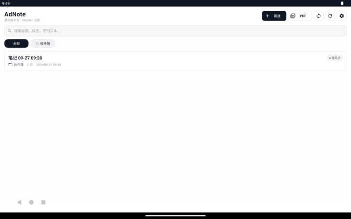
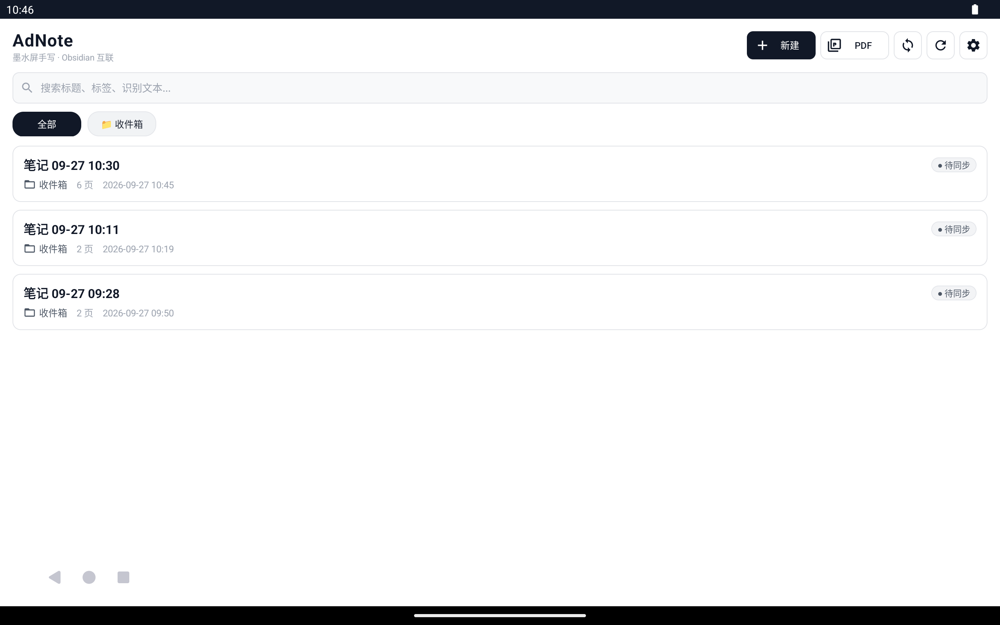
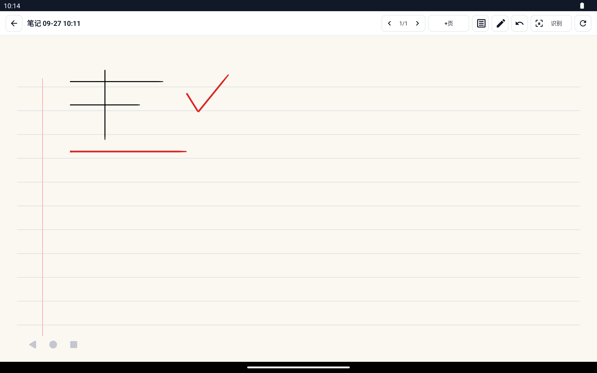
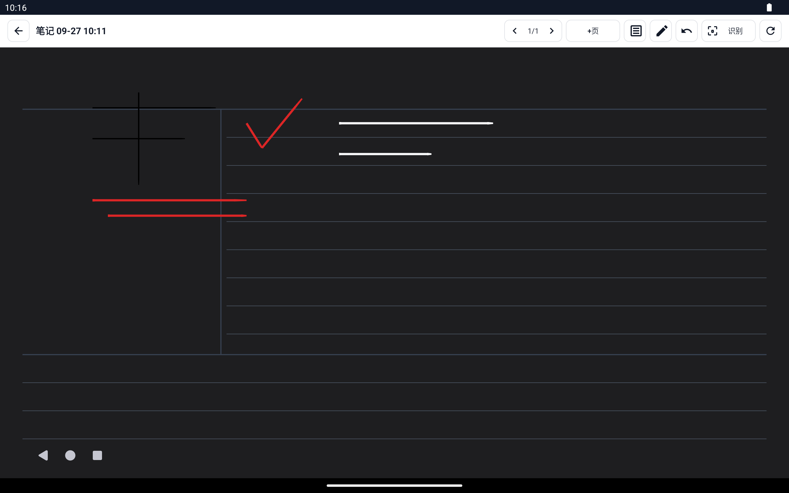
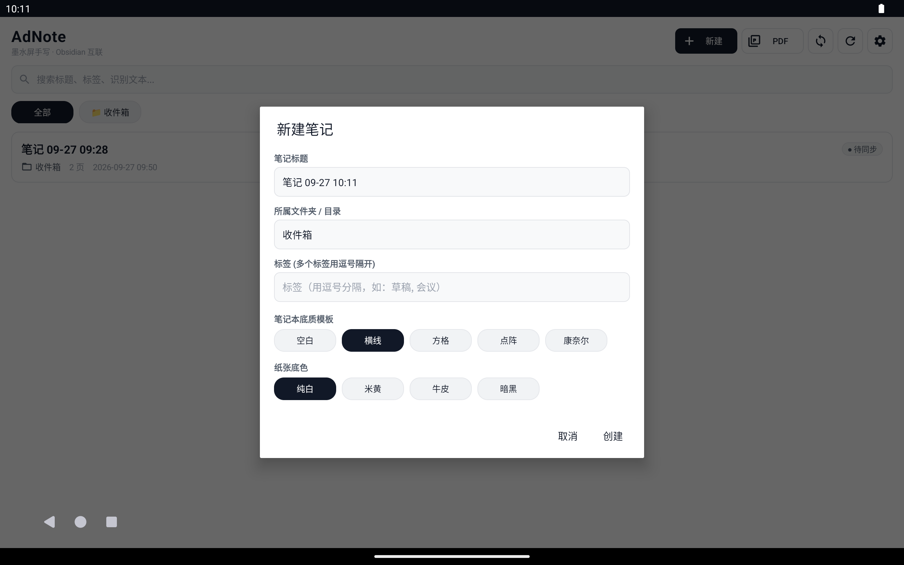

# AdNote

<p align="center">
  <b>面向墨水屏阅读器的低延迟手写笔记与 Obsidian 互联工具</b>
</p>

<p align="center">
  <a href="https://github.com/lusipad/ad-note/actions/workflows/build.yml"></a>
  <a href="https://github.com/lusipad/ad-note/releases/latest"></a>
  <a href="https://opensource.org/licenses/MIT"></a>
</p>

---

## 💡 为什么做 AdNote？

在很多墨水屏设备（如 **文石 Onyx 代工的得到阅读器 Max** 等定制固件设备）上，自带的手写笔记软件往往存在以下痛点：
1. **跨设备查看极难**：笔记封闭在设备内，无法在电脑（Mac/Windows）或手机上直接以纯文本或轻量矢量格式查看；
2. **知识组织能力弱**：缺乏灵活的标签（Tags）与层级目录支持；
3. **检索困难**：手写内容无法离线被全局搜索引擎索引。

**AdNote** 旨在彻底解决这些问题：
- 在设备上保留**原生的流畅手写体验**（基于文石官方低延迟固件通道）；
- 每次同步直接推送至个人的 **WebDAV** 服务（如坚果云、NAS）；
- 远端以 **Obsidian 原生兼容目录** 存储（`.md` + 矢量 SVG 图 + 原始笔迹 `ink.json`）；
- **双向保护合并**：你在电脑 Obsidian 里补充的打字文字、修改的标签，在下一次同步时**绝对不会被覆盖**。

---

## 🎬 交互演示

<p align="center">
  
  <br />
  <sub><i>模拟器端到端真实操作录屏：打开笔记 ➔ 实时笔锋手写 ➔ 单步撤销 ➔ 导航返回</i></sub>
</p>

## 📸 界面实测

<div align="center">

| 主界面（极简现代杂志风） | 横线护眼笔记本（多色墨水实测） |
| :---: | :---: |
|  |  |
| **康奈尔笔记法（暗黑纸张 + 粉笔白墨水）** | **新建笔记（自由选择底质模板与纸张）** |
|  |  |

</div>

---

## ✨ 核心特性

- 📓 **真实笔记本底质模板与多彩画笔墨水**：
  - **5 种专业笔记本底质**：空白（Blank）、横线（Ruled 经典横格、左侧红线装订留白）、方格（Grid 44px 精细网格）、点阵（Dot Matrix 44px 点阵圆点）、康奈尔笔记法（Cornell Notes 标准线索栏、笔记栏与底部总结栏）；
  - **4 种护眼纸张底色**：纯白（Pure White）、护眼米黄（Eye-Care Cream `#FBF8F1`）、复古牛皮（Vintage Kraft `#F0EAE1`）、深邃暗黑（Night Charcoal `#1E1E20`）；
  - **6 种墨水颜色与笔尖粗细**：墨黑、商务蓝、批注红、森林绿、铅笔灰、粉笔白，搭配细（2.0）、中（3.5）、粗（6.0）三档笔尖；
  - **暗黑模式墨水智能自适应**：切换暗黑纸张底色时，默认黑墨水自动智能转换为粉笔白墨水，防止书写隐形；
  - **全链路矢量保真导出**：底质模板与纸张底色不仅在设备屏幕上微米级精细绘制，同步到 Obsidian 的矢量 SVG 和导出的 PDF 也会完整嵌入模板图层与底色。
- ✍️ **跨设备手写与自适应适配**：
  - **文石 (BOOX) / 得到阅读器 Max**：接入官方 `TouchHelper` 固件级低延迟通道，支持电磁笔压感曲线与笔身按键整笔擦除；
  - **掌阅 (iReader) / 汉王墨水屏**：智能识别墨水屏环境，配备**通用物理反转闪刷**，解决第三方应用无硬件 SDK 时的残影问题；
  - **小米平板 (Xiaomi / Redmi) / VIVO 平板 (vivo / iQOO)**：支持 120Hz/144Hz 历史高频点采集，内置「防手掌误触模式」（仅手写笔响应，手掌压屏不误画）；
  - **智能机型感知（`DeviceDetector`）**：自动识别设备品牌、型号与屏幕材质（E-ink 墨水屏 vs 普通彩屏），自适应切换最佳通道与刷新策略。
- 📄 **PDF 导入与手写批注**：
  - **原生极简集成**：基于 Android 原生 `PdfRenderer`，无需体积臃肿的第三方库，保持极小 APK 体积与对墨水屏底层的纯粹兼容；
  - **动态视口与 LRU 缓存**：自动匹配墨水屏画布分辨率动态缩放，配备 4 页 LRU 内存位图缓存，防 OOM 且翻页丝滑；
  - **低延迟手写批注**：在 PDF 原文之上覆盖低延迟手写笔迹层，支持原笔迹批注、高亮圈点与整笔擦除；
  - **一键合并导出**：基于 `PdfDocument` 支持将原始 PDF 与手写笔迹图层合并导出为标准带批注 PDF 文档。
- 🔄 **WebDAV / Obsidian 互联同步**：
  - 自动渲染每页笔迹为轻量高清矢量 **SVG**；
  - 导出格式为标准 **Obsidian Markdown**，内置嵌入式图片引用与识别引用区；
  - 独创 **Front matter 保护 + 用户区保护 + 智能标签合并** 引擎。
- 🎨 **极简现代杂志风（Editorial Monochrome）UI**：
  - 纯白纸质底、高对比无动画样式（零过渡动画），防拖影残影；
  - 10dp 精致圆角卡片、柔和细发线边框与呼吸感排版；
  - 全套精制矢量图标（Vector Drawables），取代生硬纯文字按钮；
  - 胶囊状分类标签 Chip、PDF 专属徽标、页数统计与居中优雅空状态插画。
- 🚀 **自动化 CI/CD**：由 GitHub Actions 提供全自动化构建与验证，代码推送即运行单元测试，打标签即自动发布 Release APK。

---

## 📱 硬件与多设备兼容指南

各大墨水屏与高刷平板厂商对手写低延迟 API 的开放程度差异极大。详细的技术调研、各厂商现状与 AdNote 的自适应体系详见：
👉 **[墨水屏与各厂商硬件手写适配指南 (`docs/hardware-compatibility.md`)](docs/hardware-compatibility.md)**

- **文石 (Onyx) / 得到阅读器 Max**：优先接入官方 `TouchHelper` 固件直绘通道，延迟 < 30ms，支持笔身橡皮键与 EpdController 硬件全刷；
- **掌阅 (iReader) / 汉王墨水屏**：智能探测并启用**通用物理反转闪刷**，解决第三方应用无官方开放 SDK 时的残影困扰；
- **小米平板 (Xiaomi Pad) / VIVO 平板 (vivo Pad)**：高频采样（120Hz/144Hz 触控报点率）+ 防手掌误触模式（严格仅手写笔响应，手掌压屏不误画）。

---

## 📐 架构设计

代码采用模块化清晰分包，核心算法与领域模型不依赖 Android Framework，全部具备完整的 JVM 自动化测试：

```
com.adnote
├── model/        Note、Page、Stroke、InkPoint（纯数据模型，kotlinx.serialization）
├── ink/          StrokeGeometry（Canvas 与 SVG 共享多边形轮廓算法）、Eraser（整笔擦除相交算法）
├── pdf/          PdfImporter、PdfPageRenderer（LRU 缓存渲染）、PdfExporter（图层合并导出）
├── storage/      NoteRepository（本地原子文件存储、删除墓碑 Tombstone、全文检索）
├── export/       SvgExporter（矢量 SVG 导出）、MarkdownComposer（Obsidian 合并引擎）、RemotePaths
├── sync/         WebDavClient（基于 OkHttp 的标准 WebDAV 实现）、SyncEngine（同步调度器）
├── recognition/  Recognizer 接口 + MlKitRecognizer（Google ML Kit 中文离线手写识别）
├── pen/          PenInput 接口、OnyxPenInput（文石低延迟）、MotionPenInput（触控兜底）、EinkRefresher
└── ui/           MainActivity（笔记管理）、EditorActivity（画布手写）、SettingsActivity、InkCanvasView
```

---

## 📂 云端（WebDAV & Obsidian）文件布局

同步到 WebDAV 根目录后，可直接将该目录作为 **Obsidian 仓库（Vault）** 打开：

```text
<WebDAV 远端根目录>/                   （例如 /dav/AdNote/）
  ├── 工作/
  │    ├── 2026战略会议.md             （Obsidian 文档，含标签、识别文本与图片引用）
  │    └── _ink/
  │         └── 8f3c10a2/
  │              ├── page-001.svg      （第 1 页高保真矢量图）
  │              ├── page-002.svg      （第 2 页高保真矢量图）
  │              └── ink.json          （原始笔迹备份，可用于恢复）
  └── 读书笔记/
       └── 三体.md
```

### Markdown 文件结构示例

```markdown
---
adnote-id: 8f3c10a2b5e6
title: 2026战略会议
tags:
  - 工作
  - 规划
created: 2026-09-26T10:00:00+08:00
updated: 2026-09-26T11:30:00+08:00
custom-obsidian-meta: 这一行自定义 Front matter 不会被 AdNote 覆盖
---

（这里是用户编辑区：你在 Obsidian 里自由书写的所有分析、补充、卡片链接，AdNote 下次同步时都会完整保留！）

<!-- adnote:begin 以下内容由 AdNote 自动生成，请勿编辑 -->
## 第 1 页


> 这是由 ML Kit 离线手写识别提取出的文字内容……
<!-- adnote:end -->
```

---

## 📲 安装与使用

### 1. 下载 APK
访问 GitHub Releases 页面下载最新安装包：
- 👉 [最新发布版本（Releases）](https://github.com/lusipad/ad-note/releases/latest)
- 推荐下载正式包 **`app-release.apk`**（优化发布构建，自签名，支持直接在得到阅读器 Max、墨水屏平板或普通 Android 设备上侧载安装）；同时亦提供 `app-debug.apk` 备用。

### 2. 坚果云 / WebDAV 同步配置
在 AdNote「设置」页面中填写：
- **服务器 URL**：例如 `https://dav.jianguoyun.com/dav/`
- **用户名**：坚果云账号邮箱
- **密码**：坚果云生成的 **应用专用密码**（非网页登录密码）
- **远端根目录**：默认为 `AdNote`
- 点击「测试连接」确保配置成功。

### 3. 手写离线模型
在「设置」页点击「下载手写模型（中文简体）」，首次下载需确保网络能够访问 Google 服务；下载完成后后续所有手写识别均完全在本地离线运行。

---

## 🛠 本地开发与构建

### 运行环境
- JDK 17
- Android SDK (compileSdk 34, targetSdk 30, minSdk 26)
- Gradle 8.9

### 执行单元测试
```bash
./gradlew testDebugUnitTest
```

### 构建 APK
```bash
# 构建正式 Release 安装包（自签名，开箱即装）
./gradlew assembleRelease

# 或构建 Debug 调试包
./gradlew assembleDebug
```
产物将输出在 `app/build/outputs/apk/release/app-release.apk` 与 `debug/app-debug.apk`。

---

## 📄 开源许可证

本项目基于 [MIT License](LICENSE) 开源。
