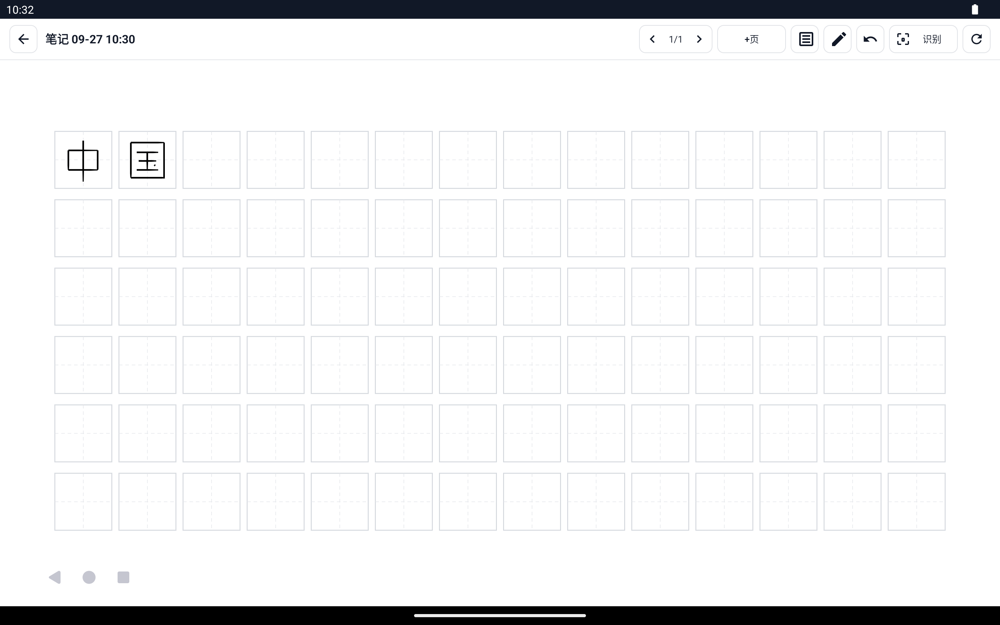
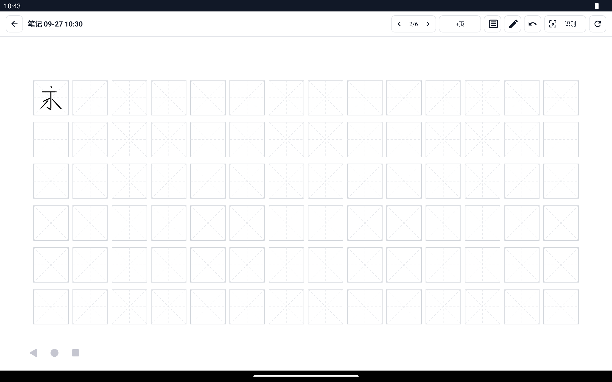
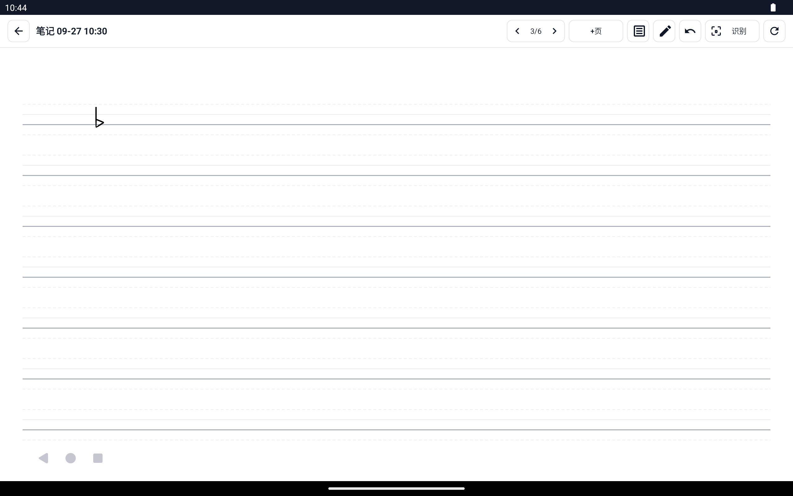
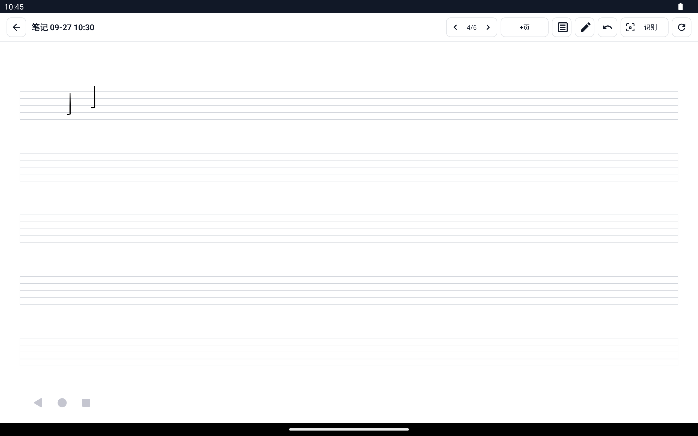
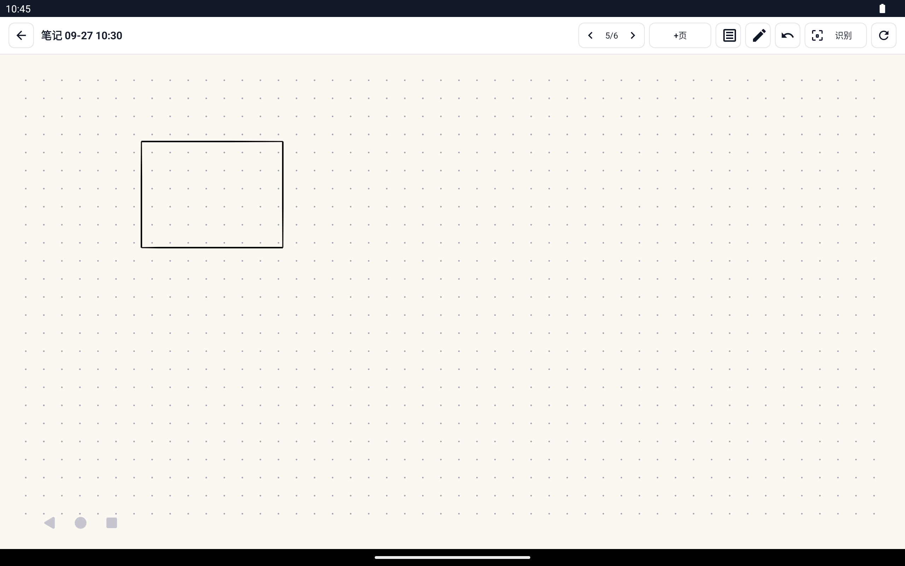
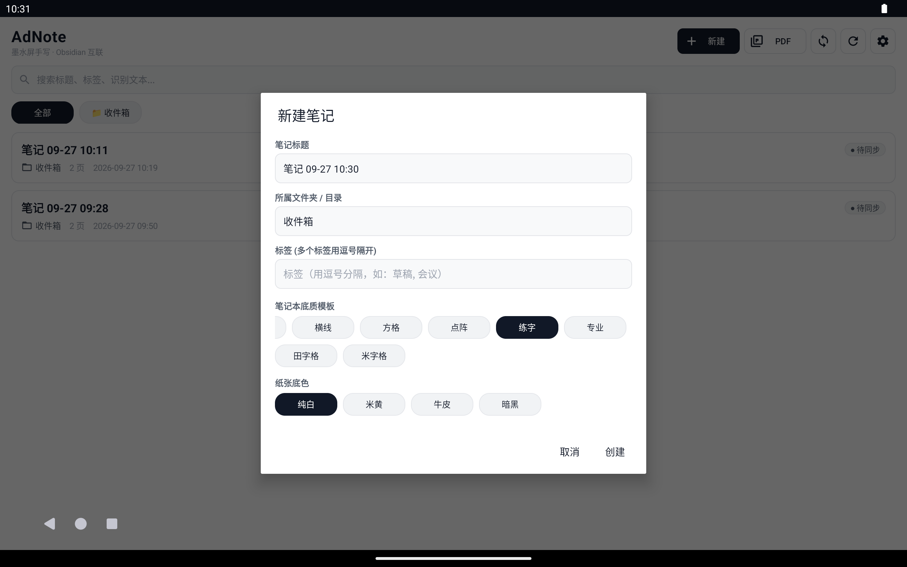

# AdNote

<p align="center">
  <b>面向墨水屏阅读器的低延迟手写笔记与 Obsidian 互联工具</b>
</p>

<p align="center">
  <a href="https://github.com/lusipad/ad-note/actions/workflows/build.yml"></a>
  <a href="https://github.com/lusipad/ad-note/releases/latest"></a>
  <a href="https://opensource.org/licenses/MIT"></a>
</p>

---

## 💡 为什么做 AdNote？

在很多墨水屏设备（如 **文石 Onyx 代工的得到阅读器 Max** 等定制固件设备）上，自带的手写笔记软件往往存在以下痛点：
1. **跨设备查看极难**：笔记封闭在设备内，无法在电脑（Mac/Windows）或手机上直接以纯文本或轻量矢量格式查看；
2. **知识组织能力弱**：缺乏灵活的标签（Tags）与层级目录支持；
3. **检索困难**：手写内容无法离线被全局搜索引擎索引。

**AdNote** 旨在彻底解决这些问题：
- 在设备上保留**原生的流畅手写体验**（基于文石官方低延迟固件通道）；
- 每次同步直接推送至个人的 **WebDAV** 服务（如坚果云、NAS）；
- 远端以 **Obsidian 原生兼容目录** 存储（`.md` + 矢量 SVG 图 + 原始笔迹 `ink.json`）；
- **双向保护合并**：你在电脑 Obsidian 里补充的打字文字、修改的标签，在下一次同步时**绝对不会被覆盖**。

---

## 🎬 交互演示

<p align="center">
  
  <br />
  <sub><i>模拟器端到端真实操作录屏：打开笔记 ➔ 实时笔锋手写 ➔ 单步撤销 ➔ 导航返回</i></sub>
</p>

## 📸 界面实测

<div align="center">

| 主界面（极简现代杂志风） | 田字格练字（国规正楷练习） |
| :---: | :---: |
|  |  |
| **米字格书法临摹（经典八法“永”字练习）** | **拼音四线格（语言习字基准线）** |
|  |  |
| **音乐五线谱（旋律记录与乐理）** | **密集点阵手账（米黄纸质 + 几何制图）** |
|  |  |
| **康奈尔笔记法（暗黑纸张 + 粉笔白墨水）** | **底质模板分类选择（分类检索 Chip）** |
|  |  |

</div>

---

## ✨ 核心特性

- 🖊 **完整的书写工具栏**（v0.2.0）：
  - **6 种笔型**：钢笔（压感笔锋）、圆珠笔（均匀线条）、铅笔（半透明灰度）、毛笔（强压感 + 起收笔尖锋）、马克笔（等宽圆头），以及独立的**荧光笔**工具（半透明叠加、不参与文字识别）；
  - **墨水与粗细**：9 种墨水色 + 5 种荧光色，粗细 1.0–24.0 无级滑杆与常用档位，对话框顶部实时预览笔迹；工具栏快捷色板记住最近使用的颜色；
  - **橡皮擦**：「局部擦除」（像真实橡皮，只擦掉经过的部分，其余拆成独立笔画）与「整笔擦除」两种模式，工具栏上直接切换擦除方式和 5 档大小，设置里可无级调节并按实际大小预览，换大小时页面上会短暂显示橡皮范围；文石设备擦除时直绘层实时画出橡皮宽度的纸色轨迹；文石笔尾/侧键擦除同样遵循该设置；
  - **套索选择**：圈选笔迹后可拖动移动、删除、复制、批量改色；
  - **撤销 / 重做**：每页独立历史（最多 100 步），书写、擦除、清空、移动选区都可撤销；外接键盘支持 Ctrl+Z / Ctrl+Y；
  - **工具状态记忆**：每种工具独立记住颜色和粗细，重新打开笔记时恢复。
- 🧰 **v0.3.0 新增：对齐原生笔记的能力**：
  - **缩放与平移**：双指缩放（最高 5 倍）、拖动平移，双击或点「复位」回到整页；页面按宽度铺满、超长页面可上下滚动；
  - **形状**：形状工具画完即规整；普通钢笔画完**停住半秒**也会自动变成直线、三角形、矩形、椭圆/圆；**直尺**贴边画直线，可拖动、双指旋转；
  - **划掉即删除**：在笔迹上来回涂抹，被涂到的笔画直接删除；
  - **文字框**：点按页面输入文字（字号、颜色可选），可把文字**链接到其他页面**；套索选中手写可一键「转文字」；
  - **图片**：插入相册图片，可拖动缩放；**自定义背景**：用图片或 PDF 第一页铺满页面，可叠加底纹；
  - **图层**：新建、重命名、显示/隐藏、调整上下顺序；书写、擦除、套索只作用于当前图层；
  - **套索增强**：拖动、拖角缩放、拖顶部圆点旋转；剪切/拷贝后可**跨页、跨笔记粘贴**（图片一并复制）；
  - **多指手势**：两指点按撤销、三指点按重做；
  - **录音**：边记边录，按页记录，列表回放、跳页；同步时上传并在 Markdown 里嵌入；
  - **导出与分享**：整本导出 PDF（含 PDF 原文底图）、本页导出 PNG，调起系统分享；
  - **目录与书签**：给页面加书签，目录一键跳转；书签同时写入 Markdown 标题；
  - **页面形态**：本页横竖切换、向下延长（长笔记）；
  - **自动识别**：离开页面时后台识别手写（需已下载离线模型），用于全文搜索和同步；
  - **回收站**：删除的笔记先进回收站，30 天内可恢复；**PIN 锁**（访问锁，文件本身不加密）；**封面色**；
  - **速记入口**：桌面长按图标「速记」、桌面小部件，一键新建并进入手写。
- ⚡ **书写体验与设备适配**：
  - **普通平板低延迟**：Android 11+ 非缓冲事件分发，Android 14+ 系统运动预测补齐笔迹末端；
  - **悬停光标**：笔尖靠近屏幕即显示落笔位置或橡皮范围；**笔身按键**可设为橡皮、套索或荧光笔；**铅笔侧锋**随笔身倾角变粗；
  - **文石适配补全**：浮动面板不再被直绘层误当成书写（排除区域）；压感上限向固件查询；翻页用快速局部刷新，每 N 页自动全刷一次（可设置）。
- 📑 **页面管理与翻页**：
  - **加页**：在当前页后插入新页（沿用本页底纹与纸色），在最后一页点「下一页」自动新建；
  - **页面概览**：点击页码打开缩略图网格，点按跳转，长按可前移/后移、复制、插入或删除页面；
  - **多种翻页方式**：顶栏翻页按钮、音量键/实体翻页键（可在设置中关闭）、手指左右滑动（手指不书写时生效）；
  - 删除页面后，下次同步会自动清理远端多余的 `page-NNN.svg`。
- 📓 **笔记本底纹与纸张**：
  - **18 种底纹（6 大类别）**：
    - **常规**：空白、康奈尔笔记法、待办清单（复选框 + 横线）；
    - **横线**：横线·中 / 宽 / 窄（左侧红色装订线）；
    - **方格**：方格·中 / 大 / 密、坐标纸（细格 + 每 5 格加深主线）；
    - **点阵**：点阵·中 / 密、等距点阵（三角网格，适合等轴测绘图）；
    - **练字**：田字格、米字格、作文稿纸（每行 20 格）；
    - **专业**：拼音四线格、音乐五线谱。
  - **缩略图选择器**：新建笔记和「底纹」对话框都以缩略图预览每种底纹，可按分类筛选，可一键应用到全部页面；
  - **7 种纸张底色**：纯白、米黄、牛皮、豆沙绿、淡蓝、暗黑、黑板；切换到暗色纸张时墨黑自动换成粉笔白；
  - **全链路一致**：屏幕、缩略图、导出的 PDF 与同步到 Obsidian 的 SVG 共用同一份底纹几何（`TemplateLayout`），外观完全一致。
- ✍️ **跨设备手写与自适应适配**：
  - **文石 (BOOX) / 得到阅读器 Max**：接入官方 `TouchHelper` 固件级低延迟通道，支持电磁笔压感曲线与笔身按键整笔擦除；
  - **掌阅 (iReader) / 汉王墨水屏**：智能识别墨水屏环境，配备**通用物理反转闪刷**，解决第三方应用无硬件 SDK 时的残影问题；
  - **小米平板 (Xiaomi / Redmi) / VIVO 平板 (vivo / iQOO)**：支持 120Hz/144Hz 历史高频点采集，内置「防手掌误触模式」（仅手写笔响应，手掌压屏不误画）；
  - **智能机型感知（`DeviceDetector`）**：自动识别设备品牌、型号与屏幕材质（E-ink 墨水屏 vs 普通彩屏），自适应切换最佳通道与刷新策略。
- 📄 **PDF 导入与手写批注**：
  - **原生极简集成**：基于 Android 原生 `PdfRenderer`，无需体积臃肿的第三方库，保持极小 APK 体积与对墨水屏底层的纯粹兼容；
  - **动态视口与 LRU 缓存**：自动匹配墨水屏画布分辨率动态缩放，配备 4 页 LRU 内存位图缓存，防 OOM 且翻页丝滑；
  - **低延迟手写批注**：在 PDF 原文之上覆盖低延迟手写笔迹层，支持原笔迹批注、高亮圈点与整笔擦除；
  - **一键合并导出**：基于 `PdfDocument` 支持将原始 PDF 与手写笔迹图层合并导出为标准带批注 PDF 文档。
- 🔄 **WebDAV / Obsidian 互联同步**：
  - 自动渲染每页笔迹为轻量高清矢量 **SVG**；
  - 导出格式为标准 **Obsidian Markdown**，内置嵌入式图片引用与识别引用区；
  - 独创 **Front matter 保护 + 用户区保护 + 智能标签合并** 引擎。
- 🎨 **极简现代杂志风（Editorial Monochrome）UI**：
  - 纯白纸质底、高对比无动画样式（零过渡动画），防拖影残影；
  - 10dp 精致圆角卡片、柔和细发线边框与呼吸感排版；
  - 全套精制矢量图标（Vector Drawables），取代生硬纯文字按钮；
  - 胶囊状分类标签 Chip、PDF 专属徽标、页数统计与居中优雅空状态插画。
- 🚀 **自动化 CI/CD**：由 GitHub Actions 提供全自动化构建与验证，代码推送即运行单元测试；合并到 main 时若 `versionName` 是新版本号，自动打 `v<版本号>` 标签并发布 Release APK（手动推 `v*` 标签同样会发布）。

---

## 📱 硬件与多设备兼容指南

各大墨水屏与高刷平板厂商对手写低延迟 API 的开放程度差异极大。详细的技术调研、各厂商现状与 AdNote 的自适应体系详见：
👉 **[墨水屏与各厂商硬件手写适配指南 (`docs/hardware-compatibility.md`)](docs/hardware-compatibility.md)**

- **文石 (Onyx) / 得到阅读器 Max**：优先接入官方 `TouchHelper` 固件直绘通道，延迟 < 30ms，支持笔身橡皮键与 EpdController 硬件全刷；
- **掌阅 (iReader) / 汉王墨水屏**：智能探测并启用**通用物理反转闪刷**，解决第三方应用无官方开放 SDK 时的残影困扰；
- **小米平板 (Xiaomi Pad) / VIVO 平板 (vivo Pad)**：高频采样（120Hz/144Hz 触控报点率）+ 防手掌误触模式（严格仅手写笔响应，手掌压屏不误画）。

---

## 📐 架构设计

代码采用模块化清晰分包，核心算法与领域模型不依赖 Android Framework，全部具备完整的 JVM 自动化测试：

```
com.adnote
├── model/        Note、Page、Stroke、TextBox、ImageItem、Layer、Recording、PenType、ToolState、PageOps、Viewport、PinLock
├── ink/          StrokeGeometry、Eraser（整笔/局部）、Lasso/Selection（套索与选区变换）、EditHistory（撤销重做）、
│                 ShapeRecognizer（形状规整）、ScratchOut（划掉删除）、Ruler（直尺吸附）、TextLayout（文字排版）
├── template/     TemplateLayout（底纹几何，屏幕/PDF/SVG 共用）
├── pdf/          PdfImporter、PdfPageRenderer（LRU 缓存渲染）、PdfExporter（图层合并导出）
├── storage/      NoteRepository（本地原子文件存储、删除墓碑 Tombstone、全文检索）
├── export/       SvgExporter（矢量 SVG 导出）、MarkdownComposer（Obsidian 合并引擎）、RemotePaths
├── sync/         WebDavClient（基于 OkHttp 的标准 WebDAV 实现）、SyncEngine（同步调度器）
├── recognition/  Recognizer 接口 + MlKitRecognizer（Google ML Kit 中文离线手写识别）
├── pen/          PenInput 接口、OnyxPenInput（文石低延迟）、MotionPenInput（触控兜底）、EinkRefresher
└── ui/           MainActivity、EditorActivity、InkCanvasView（缩放视口 + 位图缓存画布）、PageRenderer（屏幕/缩略图/导出共用）、
                  NoteExporter、ImageImporter、AudioController、TemplatePicker、PageOverviewAdapter、QuickNoteWidget
```

---

## 📂 云端（WebDAV & Obsidian）文件布局

同步到 WebDAV 根目录后，可直接将该目录作为 **Obsidian 仓库（Vault）** 打开：

```text
<WebDAV 远端根目录>/                   （例如 /dav/AdNote/）
  ├── 工作/
  │    ├── 2026战略会议.md             （Obsidian 文档，含标签、识别文本与图片引用）
  │    └── _ink/
  │         └── 8f3c10a2/
  │              ├── page-001.svg      （第 1 页高保真矢量图）
  │              ├── page-002.svg      （第 2 页高保真矢量图）
  │              └── ink.json          （原始笔迹备份，可用于恢复）
  └── 读书笔记/
       └── 三体.md
```

### Markdown 文件结构示例

```markdown
---
adnote-id: 8f3c10a2b5e6
title: 2026战略会议
tags:
  - 工作
  - 规划
created: 2026-09-26T10:00:00+08:00
updated: 2026-09-26T11:30:00+08:00
custom-obsidian-meta: 这一行自定义 Front matter 不会被 AdNote 覆盖
---

（这里是用户编辑区：你在 Obsidian 里自由书写的所有分析、补充、卡片链接，AdNote 下次同步时都会完整保留！）

<!-- adnote:begin 以下内容由 AdNote 自动生成，请勿编辑 -->
## 第 1 页


> 这是由 ML Kit 离线手写识别提取出的文字内容……
<!-- adnote:end -->
```

---

## 📲 安装与使用

### 1. 下载 APK
访问 GitHub Releases 页面下载最新安装包：
- 👉 [最新发布版本（Releases）](https://github.com/lusipad/ad-note/releases/latest)
- 推荐下载正式包 **`app-release.apk`**（优化发布构建，自签名，支持直接在得到阅读器 Max、墨水屏平板或普通 Android 设备上侧载安装）；同时亦提供 `app-debug.apk` 备用。

### 2. 坚果云 / WebDAV 同步配置
在 AdNote「设置」页面中填写：
- **服务器 URL**：例如 `https://dav.jianguoyun.com/dav/`
- **用户名**：坚果云账号邮箱
- **密码**：坚果云生成的 **应用专用密码**（非网页登录密码）
- **远端根目录**：默认为 `AdNote`
- 点击「测试连接」确保配置成功。

### 3. 手写离线模型
在「设置」页点击「下载手写模型（中文简体）」，首次下载需确保网络能够访问 Google 服务；下载完成后后续所有手写识别均完全在本地离线运行。

---

## 🛠 本地开发与构建

### 运行环境
- JDK 17
- Android SDK (compileSdk 34, targetSdk 30, minSdk 26)
- Gradle 8.9

### 执行单元测试
```bash
./gradlew testDebugUnitTest
```

### 构建 APK
```bash
# 构建正式 Release 安装包（自签名，开箱即装）
./gradlew assembleRelease

# 或构建 Debug 调试包
./gradlew assembleDebug
```
产物将输出在 `app/build/outputs/apk/release/app-release.apk` 与 `debug/app-debug.apk`。

---

## 📄 开源许可证

本项目基于 [MIT License](LICENSE) 开源。
