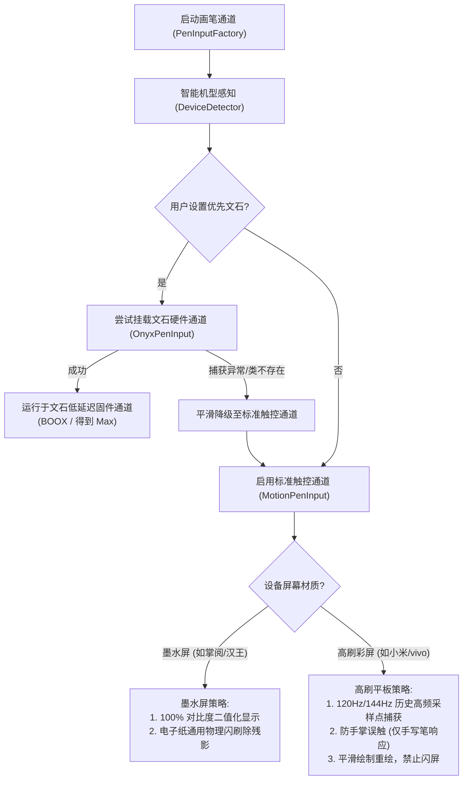

# 墨水屏与各厂商硬件手写适配指南

本文档深入记录墨水屏与高刷平板的手写技术原理、主流厂商（文石、掌阅、华为、汉王、科大讯飞、小米、VIVO 等）的 API 开放现状，以及 AdNote 的多层级自适应适配方案。

---

## 1. 墨水屏低延迟手写的技术原理

### 1.1 为什么标准 Android 渲染在墨水屏上手写延迟极高？

在普通的 LCD / OLED 屏幕（如手机、普通平板）上，标准的 Android 渲染链路如下：
```
触控中断 → MotionEvent → View 树遍历与绘制 (Canvas) → SurfaceFlinger 合成 → GPU 显示队列 → 屏幕驱动
```
整个流程耗时约 **16ms ~ 30ms**（高刷屏下更低），人眼感知基本顺畅。

但在**电子墨水屏（E-ink）**上，由于墨水微胶囊是通过物理带电颗粒移动变色，且屏幕通常由专门的 **时序控制器（TCon 芯片）** 管理灰阶波形刷新：
- Android 标准 SurfaceFlinger 合成需要经过多次缓冲与等待帧同步；
- 加上墨水屏本身的波形转换周期；
- 导致在墨水屏上使用普通 View 绘制手写笔迹时，延迟高达 **150ms ~ 300ms**，产生极严重的拖影与“笔划跟不上手”。

### 1.2 硬件级低延迟直出（Bypass 模式）的实现本质

为了实现如同真实纸笔般的即时出水体验，墨水屏厂商采用的低延迟方案通常是**旁路直写（Bypass Drawing）**：
1. **驱动直通**：当电磁笔（EMR Stylus）笔尖接触屏幕产生坐标中断时，系统 Native 服务或驱动层直接将黑线像素写进屏幕显存（Framebuffer / Direct EPD Buffer），完全绕开 Android 标准的 UI 树合成；
2. **提笔合并（Pen Up）**：当用户提笔时，驱动停止直绘，并将这一笔的坐标数据完整回调给应用程序（如 AdNote）；
3. **视图补绘与全刷**：App 将这一笔的真实矢量数据加入数据模型并在 View 层完成重绘，同时通知 EPD 控制器进行局部或全屏波形刷新以固化图像。

这种方案的代价是**极易与普通 Android 控件冲突**（例如弹窗、侧滑菜单与笔画会打架），且强依赖各家芯片平台（瑞芯微、紫光展锐、全志、联发科等）的专有时序控制器驱动。

---

## 2. 主流厂商手写与墨水屏 API 开放现状盘点

| 厂商 / 品牌 | 典型机型 | 屏幕类型 | 低延迟实现机制 | 开发者开放程度 | 实际现状与限制 |
|---|---|---|---|---|---|
| **文石 (Onyx BOOX) / 得到 Max** | NoteAir、Tab 系列、得到阅读器 Max | 墨水屏 (E-ink) | 固件级 `TouchHelper` 直绘通道与 `EpdController` | 🟢 **完全公开** (Maven Central) | **目前生态最开放、最规范**。官方维护完整 SDK 和示例，任何第三方应用均可直接依赖。 |
| **华为 (Huawei)** | MatePad Paper、MatePad 平板 | 墨水屏 / 彩屏 | `HUAWEI Pencil Engine` 笔迹引擎与高频手写预测 | 🟢 **官方开放** (HMS Core Pencil Kit) | 需接入华为 Pencil Kit。针对 MatePad Paper 墨水屏有底层预测与低延迟优化。 |
| **掌阅 (iReader)** | Smart 4、Smart Air、Ocean 系列 | 墨水屏 (E-ink) | 底层多为**瑞芯微 (Rockchip RK3566)** 私有驱动 | 🔴 **完全封闭** (仅限自带笔记与深度定制应用) | 未对外公开通用第三方 SDK。第三方应用无法通过标准公开 Maven 库直接调用其固件直出。 |
| **科大讯飞 (iFLYTEK)** | 智能办公本 X2 / X3 / Air | 墨水屏 (E-ink) | 定制芯片驱动 + 讯飞私有笔迹引擎 | 🔴 **完全封闭** | 硬件直写延迟极低，但技术完全与自带办公系统闭环，不向第三方开放任何手写加速接口。 |
| **汉王 (Hanvon)** | N10、Clear 系列 | 墨水屏 (E-ink) | 自研电磁手写笔驱动服务 | 🟡 **半公开 / 商务合作** | 少数开发者通过逆向私有 AIDL 接口调用，但缺乏稳定公开的通用 SDK，系统大版本升级容易失效。 |
| **小米 / 墨案 (Moan)** | 墨案 W7、小米多看 Pro、inkPalm | 墨水屏 (E-ink) | 早期全志 (Allwinner) 或瑞芯微 EPD 驱动节点 | 🔴 **无持续维护 SDK** | 早期机型曾流出测试 demo，但官方未建立长期演进的第三方手写开发者生态。 |
| **小米 (Xiaomi / Redmi)** | Xiaomi Pad 6 / Pad 7 | 普通高刷彩屏 (120Hz/144Hz LCD) | 标准 Android `MotionEvent` + 灵感触控笔蓝牙通道 | 🟢 **标准 Android 协议** | 无墨水屏物理延迟；依靠 120Hz/144Hz 高采样与电磁笔协议即可达到非常跟手的书写体验。 |
| **VIVO (vivo / iQOO)** | vivo Pad 2 / Pad 3 / Pad Air | 普通高刷彩屏 (144Hz LCD) | 标准 Android `MotionEvent` + vivo Pencil | 🟢 **标准 Android 协议** | 无墨水屏物理延迟；搭配系统手写笔协议可流畅书写，需重点处理手掌防误触。 |

---

## 3. 为什么掌阅、讯飞等厂商不愿开放低延迟 API？

1. **底层驱动深度定制，缺乏统一规范**：
   文石从早期就开始投入统一的 SDK 封装层，屏蔽了底层全志、飞思卡尔、高通、瑞芯微等不同芯片平台的驱动差异。而掌阅、讯飞、汉王大多是以“软硬件一体机”模式研发，手写加速模块往往直接写死在 ROM 预装的“自带备忘录”中，没有抽离成面向第三方 App 的公共 API 库。
2. **安全与稳定性考量**：
   Bypass 模式直接劫持了触控中断和 Framebuffer，若第三方 App 代码处理不当（如提笔未及时通知闭合），容易导致整机屏幕黑屏、卡死或触控失灵，厂商倾向于将其置于严格的系统权限甚至系统签名保护下。
3. **商业生态壁垒**：
   办公本、手写电纸书的核心卖点就是“手写流畅度”。若将该优势完全开放给第三方应用（如微信读书、OneNote、各类第三方笔记），自带软件和增值生态的竞争力会被削弱。

---

## 4. AdNote 的多层级跨设备适配方案

为了在保证完全开源、无侵入的前提下，兼顾各大品牌机型的最佳体验，AdNote 采用**四层渐进式自适应体系**：



### Tier 1：官方公开硬件直出层（文石 Onyx / 得到 Max）
- 采用文石官方 `TouchHelper`；
- 电磁笔笔尖接触即硬件直写，延迟 < 30ms；
- 笔身物理按键直通整笔擦除；
- 提笔自动与本地 `Note` 数据模型与 SVG 渲染器同步。

### Tier 2：通用墨水屏物理闪刷（掌阅 iReader / 汉王等）
- 针对掌阅等无公开手写 API 的墨水屏，AdNote 通过 `flashUniversalEink` 技术：
  利用短暂的（~60ms）全屏反相脉冲，驱动电子墨水微胶囊电泳颗粒强制复位；
- 无需厂商任何特权接口，即可在掌阅等设备上彻底消除残影。

### Tier 3：高刷彩屏平板优化（小米平板 / VIVO 平板）
- **高频采样捕获**：在 `MotionPenInput` 中循环捕获 `event.getHistorical*()`，充分发挥小米/vivo 120Hz/144Hz 触控报点率优势，消除折线感；
- **防手掌误触模式**：在设置中开启「防误触模式」后，严格仅响应 `TOOL_TYPE_STYLUS`，手掌大面积贴在屏幕上写字不会产生飞线或误画。

### Tier 4：智能设备检测（DeviceDetector）
- 自动根据 `Build.MANUFACTURER`、`Build.BRAND`、`Build.MODEL` 等硬件指纹，辨识设备归属；
- 在设置页直接反馈当前硬件通道与运行状态，支持用户自主控制。

---

## 5. 后续演进路线

1. **华为 Pencil Kit 集成**：为华为 MatePad Paper / MatePad 系列接入官方手写套件；
2. **瑞芯微 RK3566 私有接口探针**：利用 `hiddenapibypass`，在掌阅部分开放机型上探测底层 `EpdController` 隐藏类，若存在则尝试自动挂载硬件加速；
3. **AndroidX 手写预测补偿算法**：引入卡尔曼滤波与外插预测，在通用通道上提前预测 1~2 个采样点，进一步减少视觉上的迟滞感。
